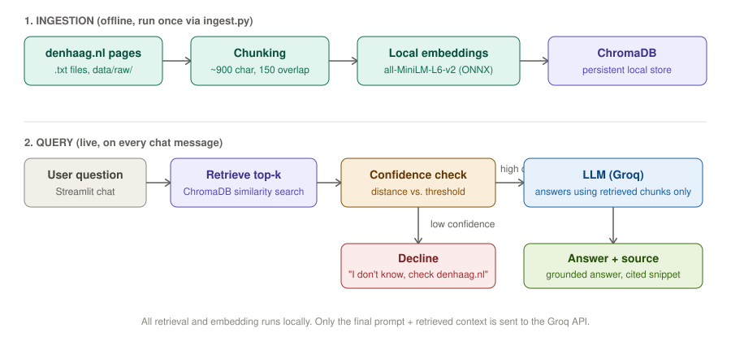

# AI Municipality Assistant — Den Haag

A retrieval-augmented (RAG) chat assistant that answers resident and staff
questions using only official Den Haag municipality documents — and says
"I don't know" rather than guessing when a question falls outside what it's
been given.



---

## Business problem

Residents and municipal staff have to dig through scattered policy pages
and FAQ documents to find accurate answers — and generic chatbots that rely
on general knowledge will confidently hallucinate on official information,
which is a real risk when the answer involves a legal deadline (e.g. "report
your move within 5 days") or a specific fee. This project builds a narrow,
grounded assistant that only answers from a defined set of ingested
documents, and explicitly declines when it doesn't know — trading
completeness for trustworthiness.

## Target users

- **Den Haag residents** looking for quick, accurate answers on everyday
  municipal procedures (moving, parking, passports, waste, taxes).
- **Municipal staff**, who could use the same tool as a first-line lookup
  aid instead of manually searching policy pages.
- The same architecture doubles as a pitch for an internal "knowledge bot"
  for organisations like TNO, Capgemini, Accenture, or Deloitte — any
  setting with a large, scattered internal document set and a low tolerance
  for wrong answers.

## Assumptions & scope

- Answers are generated **only** from the ingested documents — never from
  the LLM's general knowledge.
- English only for v1 (Dutch is a planned extension, see Future
  improvements).
- The document set is a small, manually curated sample of denhaag.nl pages
  (moving/address registration, parking permits, passports, bulky waste
  collection, waste tax) — **not** a live crawl of the full municipality
  site.
- This is a portfolio demo only: no authentication, no connection to real
  citizen data or municipal systems, and no legal or financial advice
  should be taken from it.

## Tech stack

| Component | Choice | Why |
|---|---|---|
| Embeddings | `all-MiniLM-L6-v2` (via ChromaDB's built-in ONNX runtime) | Free, runs fully locally, no GPU needed, avoids a heavyweight PyTorch install |
| Vector store | ChromaDB (persistent local client) | Free, zero-infrastructure, trivial to set up for a demo-scale corpus |
| LLM | Groq (Llama 3.3 70B) | Free tier, very low latency — good for a live demo |
| UI | Streamlit | Fastest path to a shareable, public chat interface |
| Orchestration | Plain Python (no LangChain/LlamaIndex) | At this scale (~5 documents, one retrieval step) a framework adds indirection without adding capability; hand-rolled code keeps the confidence-threshold logic fully visible and easy to explain |

## System architecture

**Ingestion (offline, run once):** raw denhaag.nl pages → chunked into
~900-character overlapping chunks → embedded locally with MiniLM → stored
in a persistent ChromaDB collection, each chunk carrying its source title,
URL, and category as metadata.

**Query (live, per chat message):** user question → embedded → ChromaDB
top-k similarity search → **confidence check** on the best match's distance
score → if confidence is low, the assistant declines and points to
denhaag.nl directly; if confidence is high, the retrieved chunks are passed
to the LLM inside a strict prompt that forbids answering outside that
context → the answer is shown alongside the exact source snippet(s) it came
from.

See `architecture-diagram.svg` above, or `ingest.py` / `rag.py` for the
implementation.

## Sample inputs & outputs

> **Q: How do I register a change of address in Den Haag?**
> **A:** Report your move to the municipality within 5 days after moving
> (or up to 4 weeks before). You can do this online with DigiD, by post, or
> in special cases at a municipal counter. You'll need proof of your new
> address, such as your rental contract or purchase deed. Online reports
> are processed within 5 working days.
> **Source:** *Report your move* — denhaag.nl/en/moving-and-immigration/report-your-move/

> **Q: What's the best neighbourhood in Den Haag for families?** *(out of scope)*
> **A:** I don't know — this doesn't look like it's covered in my current
> documents. Please check denhaag.nl directly or contact the municipality
> (tel. 14070).

## Prompt design

The single most important line in this project is the system prompt's
grounding rule:

> "Answer ONLY using the CONTEXT provided below... If the CONTEXT does not
> contain enough information to answer the question, respond with exactly:
> 'I don't know — please check denhaag.nl directly or contact the
> municipality.' Do not guess, and do not fill gaps with general knowledge."

This is paired with a **similarity-distance threshold** applied *before*
the LLM is even called: if the best-matching chunk is too dissimilar to the
question, the pipeline declines immediately without spending an LLM call —
a second, independent line of defence against hallucination on top of the
prompt instruction. See `rag.py::SYSTEM_PROMPT` and `DISTANCE_THRESHOLD`.

## Evaluation & testing

15 test questions — 10 answerable from the ingested documents, 5
deliberately out of scope — are defined in `eval/questions.md` and run
automatically by `eval/run_eval.py`. A documented, non-zero "I don't know"
rate on the out-of-scope set is treated as a *good* result, not a weakness:
it's evidence the grounding is working rather than the model quietly
filling gaps with plausible-sounding general knowledge.

Run it yourself:
```bash
python ingest.py               # populate ChromaDB (first time only)
export GROQ_API_KEY=your_key
python eval/run_eval.py
```

## Limitations

- Small, manually curated document set (5 pages, ~25 chunks) — not
  live/real-time, and far from the full denhaag.nl site.
- The confidence signal is a simple cosine-distance threshold on the
  top retrieved chunk, not a calibrated confidence score — it can still be
  fooled by a question that is *lexically* similar to a document but asks
  something the document doesn't actually answer.
- No authentication, and no handling of real citizen data — this is a
  demo, not a production service.
- English only; no Dutch-language support yet.

## Future improvements

- Add Dutch-language support (both for ingested documents and for
  questions/answers).
- Expand the document set toward full coverage of denhaag.nl's English
  section.
- Add a second "checker" LLM pass that reviews the primary answer against
  the retrieved context before it's shown to the user, as an extra
  hallucination safety net.
- Add observability (e.g. Langfuse) to track retrieval quality, confidence
  scores, and decline rates over time in production.
- For real production scale, migrate from local ChromaDB to a managed
  vector database (e.g. Pinecone, Weaviate Cloud, or pgvector on managed
  Postgres) to support concurrent users and a much larger corpus.

## Demo video

*(2-5 min — add link here once recorded)*
Shows 3 in-scope questions answered correctly with cited sources, plus 1
out-of-scope question correctly declined.

## Repository structure

```
.
├── app.py                    # Streamlit chat UI
├── ingest.py                 # Chunking + embedding + ChromaDB ingestion
├── rag.py                    # Retrieval, confidence check, prompt, LLM call
├── requirements.txt
├── architecture-diagram.svg
├── data/
│   ├── raw/                  # Source documents (denhaag.nl pages, cleaned)
│   └── chroma/                # Persisted vector store (generated by ingest.py)
└── eval/
    ├── questions.md          # 15-question test set + results table
    └── run_eval.py           # Automated eval runner
```

## Running locally

```bash
git clone <your-repo-url>
cd ai-municipality-assistant
pip install -r requirements.txt

python ingest.py                    # builds the local ChromaDB index

export GROQ_API_KEY=your_key_here   # free key at console.groq.com
streamlit run app.py
```

## Live deployment

*(add your Streamlit Community Cloud / Hugging Face Spaces link here once deployed)*

Deploying to Streamlit Community Cloud: push this repo to GitHub, connect
it at share.streamlit.io, add `GROQ_API_KEY` as a secret, and set the main
file to `app.py`. Streamlit Cloud runs `ingest.py`'s dependencies fine out
of the box since it has normal internet access — but note that `data/chroma`
is not committed to the repo by default (it's a build artifact), so add a
one-time build step or a Streamlit startup hook that runs `ingest.py` if
`data/chroma` is empty.

## Data sources

Source pages copied manually from denhaag.nl's public English section, for
portfolio/demo use:
- [Report your move](https://www.denhaag.nl/en/moving-and-immigration/report-your-move/)
- [Apply for or renew parking permit for residents](https://www.denhaag.nl/en/parking/apply-for-parking-permit-for-residents/)
- [Apply for a Dutch passport for an adult](https://www.denhaag.nl/en/passport-and-identity-card/apply-for-a-dutch-passport-for-an-adult/)
- [Arrange collection of bulky waste or garden waste](https://www.denhaag.nl/en/waste-and-recycling/arrange-collection-of-bulky-waste-and-garden-waste/)
- [Waste tax](https://www.denhaag.nl/en/taxes/waste-tax/)
